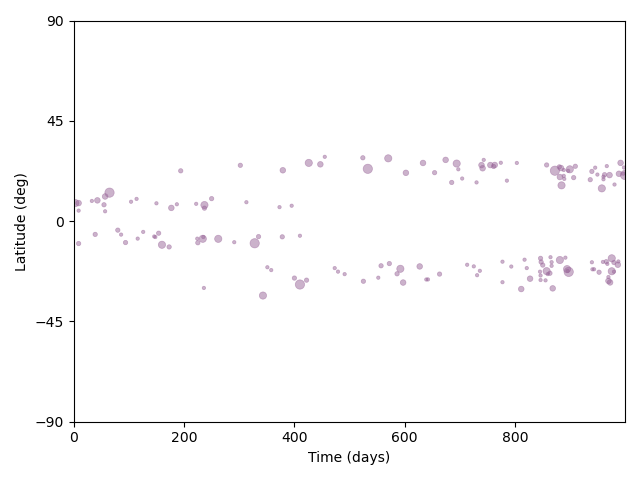
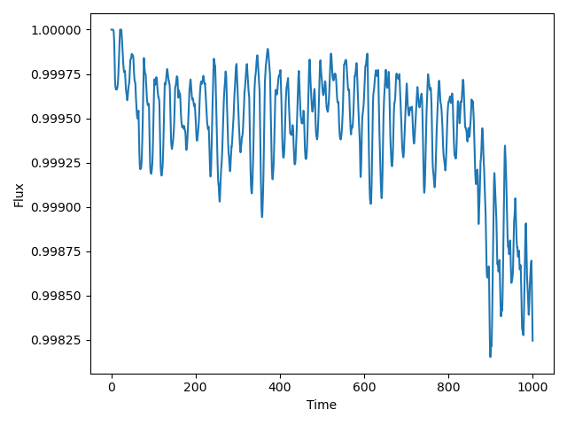

# Butterpy

Simulate starspot evolution and the corresponding lightcurves.

**Primary author of Python implementation: [Zachary Claytor](https://github.com/zclaytor)**

The code is written in both Python and Julia. See the Butterfly.jl section for the Julia documentation. The Python code can be found under the `butterpy` directory.

To cite the code, please use the introductory paper by [Claytor et al. (2022)](https://ui.adsabs.harvard.edu/abs/2022ApJ...927..219C/abstract) and the Zenodo DOI [10.5281/zenodo.4722052](https://zenodo.org/record/4722052).

## Butterpy installation

You can install `butterpy` using pip. I'm hoping to have 1.0.0 on PyPI soon, but for now use this:

```bash
pip install git+https://github.com/zclaytor/butterpy
```

## Butterpy usage

See `notebooks/surface_fig.ipynb` for general usage, but here's a quick guide to simulating a Solar-like star.

```python
import butterpy as bp
import matplotlib.pyplot as plt

# Initialize surface. You almost never need to supply arguments.
s = bp.Surface()

# Emerge active regions
regions = s.emerge_regions(
  ndays=1000,
  activity_level=1, 
  cycle_period=11,
  cycle_overlap=2,
  )

# From active regions, compute spot evolution and light curve
lightcurve = s.evolve_spots(
  incl=80,
  period=24.5,
  shear=0.2,
)

# Plot butterfly diagram and light curve
s.plot_butterfly()
plt.tight_layout()

s.plot_lightcurve()
plt.tight_layout()
```




You can also make animations using `Surface.animate_spots`. Check the documentation for more!

## Butterfly.jl

**Primary author of Julia implementation: [Miles Lucas](https://github.com/mileslucas)**

The Julia implementation is derived from the python work but applies Julian best practices. The Julia code can be found under the `src` directory. This requires Julia 1.2 or greater, and greatly benefits from the stability in multithreading found in Julia 1.3. Visit the [Julia website](https://julialang.org) for information on how to get Julia set up.

## Butterfly.jl installation

Once you have Julia set up, enter the REPL

```bash
julia
```

and set up the environment

```julia
julia> ]

(v1.2) pkg> dev .

(v1.2) pkg> <backspace>

julia> using Butterfly
```

## Butterfly.jl usage

The main workflow is similar to the python implementation

### Generate and evolve starspots

```julia
julia> spots = evolve() # Solar values by default for 10 year time-span
3371-element Array{Spot,1}:
 Spot{Float64}(25, -0.16473381557930752, 0.6011891165889124, 151.63266492815836, 0.0) 
 Spot{Float64}(28, -0.1513712338337426, 6.279352287829287, 151.63266492815836, 0.0)   
 Spot{Float64}(35, -0.1678121828423019, 0.1170635115755915, 250.0, 0.0)               
 Spot{Float64}(46, -0.1087039654086646, 0.5784711270698818, 33.833820809153174, 0.0)  
 Spot{Float64}(47, -0.1223988077838112, 3.248376887285918, 33.833820809153174, 0.0)   
 Spot{Float64}(56, 0.16106980965050208, 4.880251878214368, 91.96986029286062, 0.0)    
 Spot{Float64}(56, -0.20579341905391327, 4.482267038663841, 33.833820809153174, 0.0)  
 ⋮
 Spot{Float64}(3645, 0.30590153485394156, 3.004852147666298, 151.63266492815836, 0.0) 
 Spot{Float64}(3645, -0.18449038285124816, 6.089091009925041, 33.833820809153174, 0.0)
 Spot{Float64}(3646, 0.18567945472506195, 4.543798473242256, 151.63266492815836, 0.0) 
 Spot{Float64}(3646, -0.23634723943652297, 0.6475271827528074, 91.96986029286062, 0.0)
 Spot{Float64}(3648, -0.0974766691802325, 4.791006457613271, 33.833820809153174, 0.0) 
 Spot{Float64}(3648, 0.253768420357385, 5.710141733818553, 33.833820809153174, 0.0)   
 Spot{Float64}(3649, 0.21079744615702228, 1.0139028758201174, 33.833820809153174, 0.0)

julia> spots = evolve(
            butterfly = true,
            activity_rate = 1,
            cycle_length = 11,
            cycle_overlap = 2,
            max_ave_lat = 35,
            min_ave_lat = 7,
            tsim = 3650,
            tstart = 0) # equivalent to above
```

you can view the docstring by pressing `?` and then typing in `evolve` like so

```julia
help?> evolve
search: evolve

  evolve(;
      butterfly = true,
      activity_rate = 1,
      cycle_length = 11,
      cycle_overlap = 2,
      max_ave_lat = 35,
      min_ave_lat = 7,
      tsim = 3650,
      tstart = 0)

  Simulates the emergence and evolution of starspots. 

  Output is a list of active regions.

  Parameters
  ≡≡≡≡≡≡≡≡≡≡≡≡

    •    butterfly = bool - have spots decrease from maxlat to minlat or be randomly located in latitude

    •    activityrate = Number of magnetic bipoles, normalized such that for the Sun, activityrate = 1.

    •    cycle_length - length of cycle in years (Sun is 11)

    •    cycle_overlap - overlap of cycles in years

    •    maxavelat = maximum average latitude of spot emergence (deg)

    •    minavelat = minimum average latitutde of emergence (deg)

    •    tsim = how many days to emerge spots for

    •    tstart = First day to simulate bipoles

  Based on Section 4 of van Ballegooijen 1998, ApJ 501: 866 and Schrijver and Harvey 1994, SoPh 150: 1S Written by Joe Llama (joe.llama@lowell.edu) V
  11/1/16 Converted to Python 3 9/5/2017

  According to Schrijver and Harvey (1994), the number of active regions emerging with areas in the range [A, A+dA] in time interval dt is given by

  n(A, t) dA dt = a(t) A^(-2) dA dt,

  where A is the "initial" bipole area in square degrees, and t is the time in days; a(t) varies from 1.23 at cycle minimum to 10 at cycle maximum.

  The bipole area is the area with the 25-Gauss contour in the "initial" state, i.e., at the time of maximum development of the active region. The
  assumed peak flux density in the initial state is 100 G, and width = 0.4bsiz.
```

## Simulate Light Curves

Start by creating a `SpotDynamics` object

```julia
julia> sd = SpotDynamics(spots)
SpotDynamics{Float64}
  nspots: 3370
  duration: 3649.0
  inclination: 0.24972224678784558
  ω: 2.9682470272012405e-6
  Δω: 5.936494054402481e-7
  equatorial_period: 24.5
  τ_emergence: 24.5
  τ_decay: 122.5
```

```julia
help?> SpotDynamics
search: SpotDynamics

  SpotDynamics(spots::AbstractVector{Spot};
      duration = maximum([s.nday for s in spots]),
      alpha_med = 0.0001,
      inclination = asin(rand()),
      ω = 1.0,
      Δω = 0.2,
      τ_decay = 5.0,
      threshold = 0.1)

  A container for the dynamics of starspots.

  Parameters
  ≡≡≡≡≡≡≡≡≡≡≡≡

    •    spots - The list of Spots evolved over time

    •    duration - The length of the evolution time

    •    alpha_med - An activation parameter for the magnetic flux

    •    inclination - Inclination of the star from our line of sight in radians

    •    ω - Rotational velocity of the star in solar units

    •    Δω - change in rotational velocity over the time in solar untis

    •    τ_decay - The decay timescale

    •    threshold - The threshold in magnetic flux for filtering starspots
```

to view the modulation of the star's flux at a given timestep, use `modulate`

```julia
julia> df = modulate(sd, 0)
-3.7839717125012525e-5

julia> dfs = modulate.(sd, 0:0.01:1)
101-element Array{Float64,1}:
 -3.7839717125012525e-5
 -3.779490759845662e-5 
 -3.7749334907885015e-5
 -3.7702998398295e-5   
 -3.765589741966958e-5 
 -3.760803132698725e-5 
 -3.755939948023161e-5 
  ⋮                    
 -3.025936981252681e-5 
 -3.014146726718377e-5 
 -3.0022765393355793e-5
 -2.9903264042371397e-5
 -2.978296307128816e-5 
 -2.9661862342899073e-5
 -2.953996172573867e-5
```

```julia
help?> modulate
search: modulate

  modulate(::SpotDynamics, time)

  Modulate the flux due starspots at the given timestep in days.
```

we can simulate using multithreading using `simulate`. Note, you must have the environment variable `JULIA_NUM_THREADS` set to make use of multithreading.

```julia
julia> dfs = simulate(sd, duration=365, cadence=60)
8761-element Array{Float64,1}:
 -3.7839717125012525e-5 
 -3.764797288782288e-5  
 -3.744294368105203e-5  
 -3.7224583843915496e-5 
 -3.6992849236707684e-5 
 -3.674769725267416e-5  
 -3.648908682971768e-5  
  ⋮                     
 -0.00017763548300495392
 -0.0001785040018698553 
 -0.00017945659679677306
 -0.00018040299273987162
 -0.00018134308150915572
 -0.00018227675569909986
 -0.00018320390870043565
```

```julia
help?> simulate
search: simulate

  simulate(::SpotDynamics; duration=3650, cadence=30)

  Simulate the lightcurve modulation over duration days every cadence minutes.

  ───────────────────────────────────────────────────────

  simulate(::DataFrameRow; duration=3650, cadence=30)

  Given a row from a dataframe with simulation data, will simulate the lightcurve modulation over duration days every cadence minutes.

  ───────────────────────────────────────────────────────

  simulate(::DataFrame; duration=3650, cadence=30)

  Given a full dataframe with simulation data, will return a Vector of lightcurve modulations over duration days every cadence minutes.

```

## Generating Simulation Sets

Using `generate_simdata` we can produce a dataframe of simulation data that can be saved and passed directly to `simulate`

```julia
help?> generate_simdata
search: generate_simdata

  generate_simdata(n::Integer)

  Generate n simulation datasets returned in a DataFrame.
```

## Benchmarks

In the directory `bench` there are some benchmarks comparing Python performance to Julia. In general, Julia is ~2x faster than Python when using multithreading.
